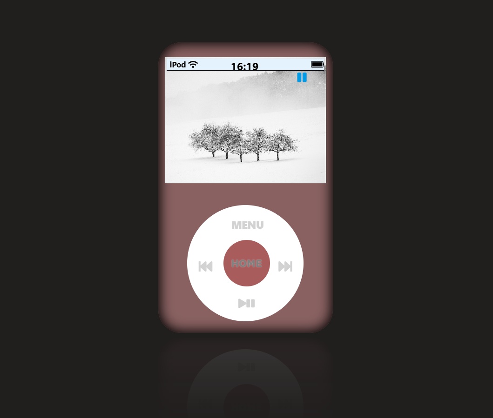
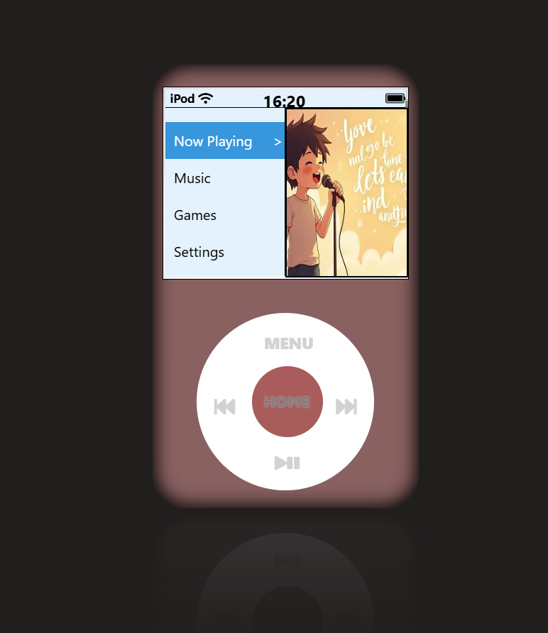
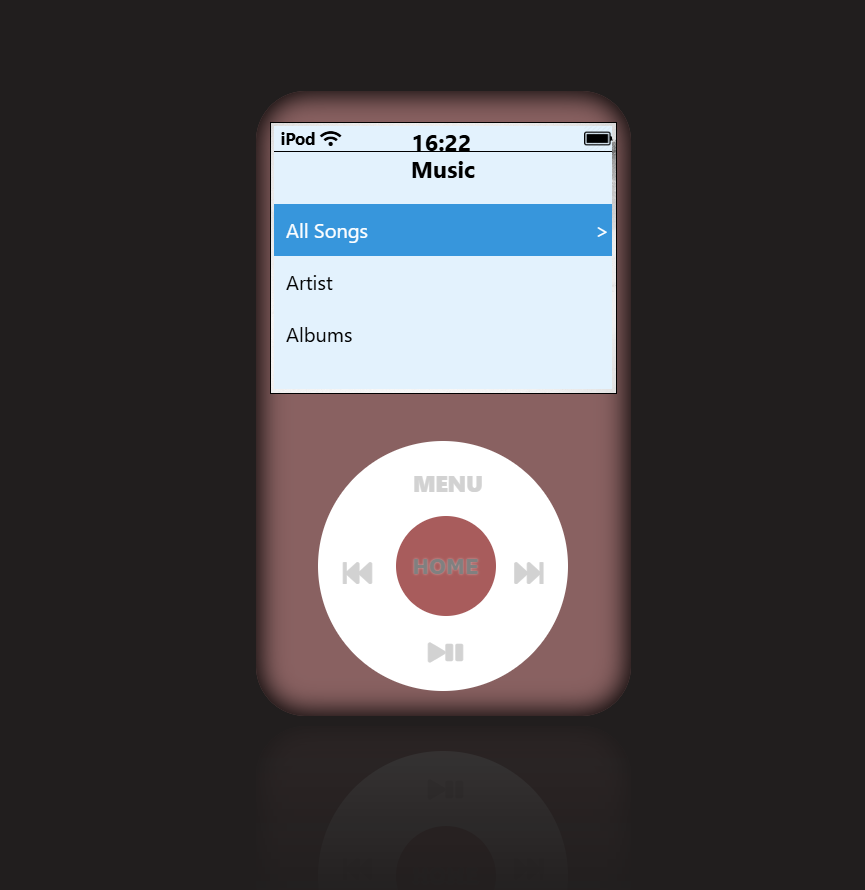
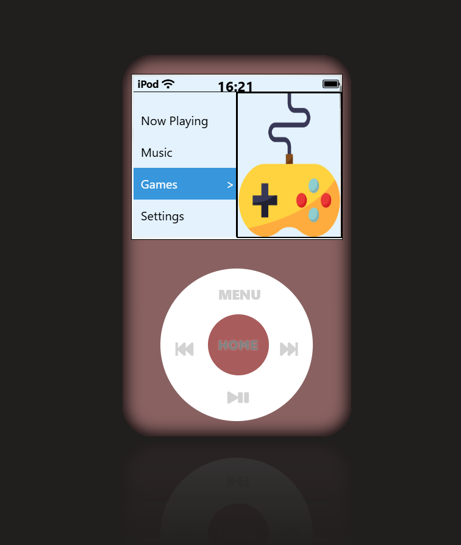
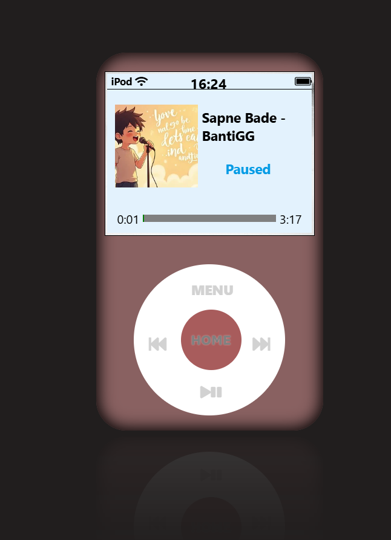

# iPod Emulator 🎧

A fully functional iPod-like music player built using **React.js**. This app emulates the classic iPod interface with a scroll wheel and multiple menus, including music playback, settings, themes, wallpapers, and more.

## 🔥 Features

- ✅ iPod-like UI with scroll wheel interaction using `ZingTouch`
- 🎵 Music playback with play/pause, forward, rewind functionality
- 🎨 Theme customization (colors, wallpapers)
- ⚙️ Settings and menu navigation
- 📜 Smooth transitions between nested menus
- 🧠 State handled in the root `App.js` component and passed via props

## 🚀 How to Run Locally

# Clone the repository
git clone https://github.com/Mohit-coder75/ipod.git
cd ipod-clone

# Install dependencies
npm install

# Start development server
npm start

## 🖼️ UI Preview

### 🔘 Home Screen

### 📋 Menu Items

### 🎵 Music Section

### 🔄 Menu Navigation

### ▶️ Playing Screen

